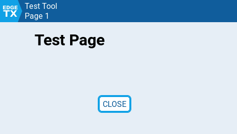
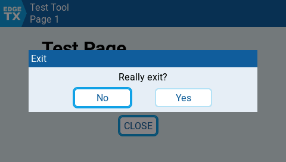

# Examples

### One-Time script

```lua
local exitTool = false

local function close()
  lvgl.confirm({title="Exit", message="Really exit?",
    confirm=(function() exitTool = true end)
  })
end

local function init()
  if lvgl == nil then return end

  lvgl.clear();

  local pg = lvgl.page({title="Test Tool", subtitle="Page 1", back=close})

  pg:label({x=70, y=16, color=BLACK, font=DBLSIZE, text="Test Page"})
  pg:button({x=200, y=150, text="CLOSE", press=close})
end

local function run(event, touchState)
  if lvgl == nil then
    lcd.drawText(0, 0, "LVGL support required", COLOR_THEME_WARNING)
  end

  if (exitTool) then return 2 end
  return 0
end

return {init = init, run = run, useLvgl=true}
```

When run this produces the page shown below.



The user can exit the script by tapping the 'CLOSE' button or tapping the 'EdgeTX' button in the top-left corner. In both cases a popup dialog will be shown - if the user selects 'Yes' the script will close.



### Widget script

LVGL version of the 'Counter' script.

```lua
local options = {
  { "Color", COLOR, COLOR_THEME_SECONDARY1 },
  { "Shadow", BOOL, 0 }
}

local function create(zone, options)
  local wgt = { zone=zone, options=options, counter=0 }
  return wgt
end

local function update(wgt, options)
  wgt.options = options

  lvgl.clear()

  if wgt.options.Shadow ~= 0 then
    lvgl.label({x=wgt.zone.x+1, y=wgt.zone.y+1, color=BLACK, font=DBLSIZE, text=(function() return wgt.counter end)})
  end
  lvgl.label({x=wgt.zone.x, y=wgt.zone.y, color=wgt.options.Color, font=DBLSIZE, text=(function() return wgt.counter end)})
end

local function background(wgt)
  wgt.counter = wgt.counter + 1
end

function refresh(wgt)
  wgt.counter = wgt.counter + 1
end

return { name="CounterLVGL", options=options, create=create, update=update, refresh=refresh, background=background, useLvgl=true }
```
