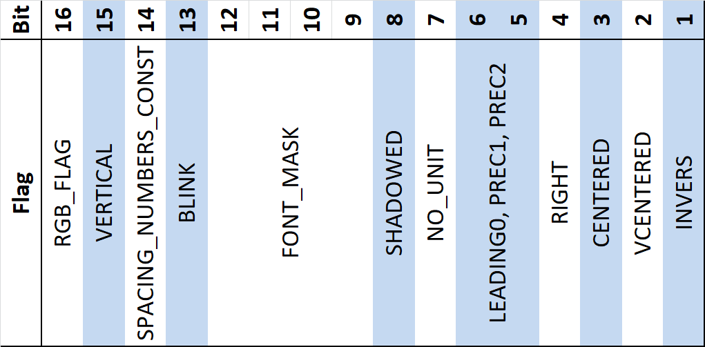

# Drawing Flags and Colors

A number of drawing flags can be given for the various functions that draw on the screen. The lower half of the flags \(bits 1-16\) are the flag attributes shown below, and the upper half of the flags \(bits 17-32\) are a color value.

Not all of the flags below should be directly manipulated from Lua, but those that are meant to be set directly by Lua, are accessible by the [Lua flag constants](../part_iii_-_opentx_lua_api_reference/constants/flags-and-pattern-constants.md#flags).

RGB\_FLAG decides how the color value is encoded into the upper half \(bits 17-32\). 

If RGB\_FLAG = 0, then an index into a color table is stored. This color table holds a default color \(index 0\), the theme colors, and CUSTOM\_COLOR. The entries in the color table can be changed with the function [`lcd.setColor`](../part_iii_-_opentx_lua_api_reference/lcd-functions-less-than-greater-than-luadoc-begin-lcd/setcolor.md). The advantage of this system is that the color changes everywhere that this indexed color is used, and this is how different color themes are created. **Notice that changing the theme colors affects the entire user interface of your radio!!**

If RGB\_FLAG = 1, then a 16-bit RGB565 color is stored. This is used directly by the system to draw a color on the screen.

You should not change RGB\_FLAG, this is handled automatically by the various functions and Lua constants. But you should be aware of the following.

* [`lcd.setColor`](../part_iii_-_opentx_lua_api_reference/lcd-functions-less-than-greater-than-luadoc-begin-lcd/setcolor.md) must have an indexed color as the first argument, as this will be the index of the color table that is changed. Giving another color, e.g. ORANGE, as the first argument will result in nothing.
* If no color flags are given, the RGB\_FLAGS = 0 and the color index = 0. Therefore, the default color is stored at the color table under this index, and you can change the default color with `lcd.setColor(0, color)`.
* [`lcd.getColor` ](../part_iii_-_opentx_lua_api_reference/lcd-functions-less-than-greater-than-luadoc-begin-lcd/getcolor.md)always returns a RGB color. This can be used to "save" an indexed color before you change it.

