# Radios

## Radios with B&W LCD screen

<table class="radio-list-table radio-overview-list-table">
<thead><tr><th>Model</th><th>Manufacturer</th><th>from EdgeTX</th></tr></thead>
<tbody>
<tr><td>
<a href="betafpv/betafpv-literadio3-pro/">LiteRadio3 Pro</a>
</td><td>BetaFPV</td><td>-</td></tr>
<tr><td>
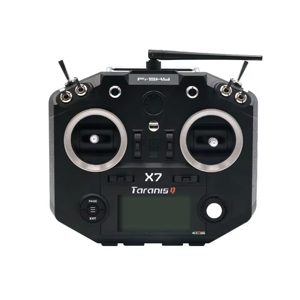<a href="frsky/frsky-qx7-qx7s/">QX7 / QX7S / QX7 ACCESS / QX7S ACCESS</a>
</td><td>FrSky</td><td>2.10</td></tr>
<tr><td>
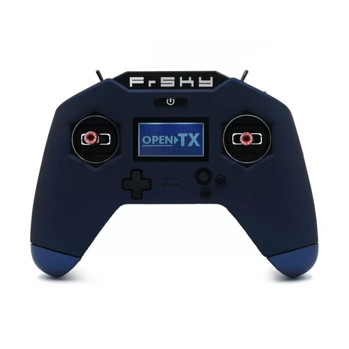<a href="frsky/frsky-x-lite-x-lite-s-x-lite-pro/">X-Lite / X-Lite S / X-Lite Pro</a>
</td><td>FrSky</td><td>2.10</td></tr>
<tr><td>
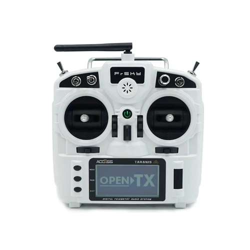<a href="frsky/frsky-x9-lite-x9-lite-s/">X9 Lite / X9 Lite S</a>
</td><td>FrSky</td><td>2.10</td></tr>
<tr><td>
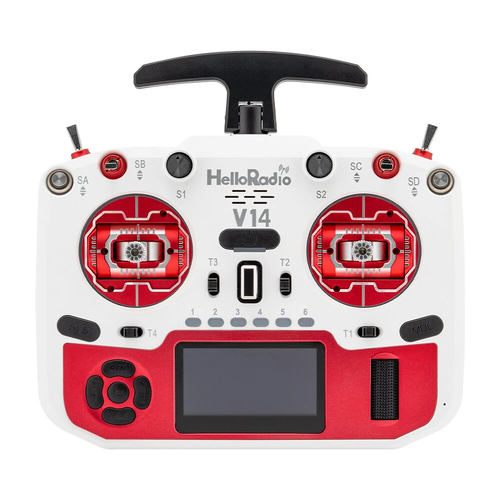<a href="helloradiosky/helloradiosky-v14/">V14</a>
</td><td>HelloRadioSky</td><td>2.11</td></tr>
<tr><td>
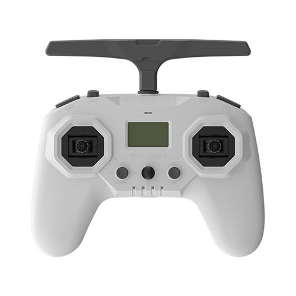<a href="iflight/iflight-commando8/">Commando8</a>
</td><td>iFlight</td><td>2.10</td></tr>
<tr><td>
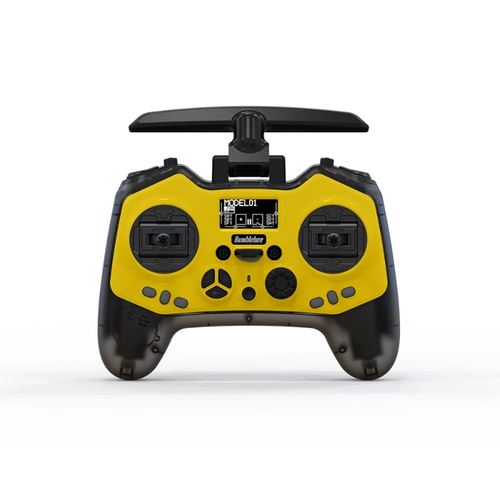<a href="jumper/jumper-bumblebee/">Bumblebee</a>
</td><td>Jumper</td><td>2.10</td></tr>
<tr><td>
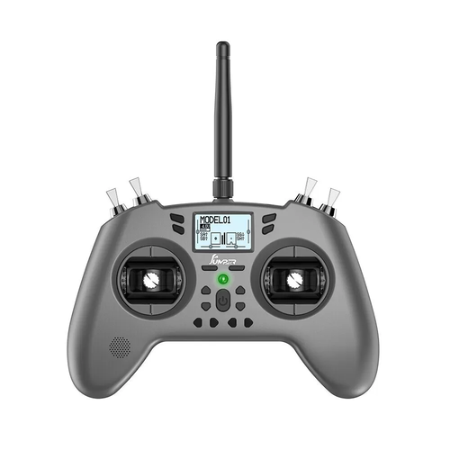<a href="jumper/jumper-t-lite-t-lite-v2/">T-Lite / T-Lite v2</a>
</td><td>Jumper</td><td>2.10</td></tr>
<tr><td>
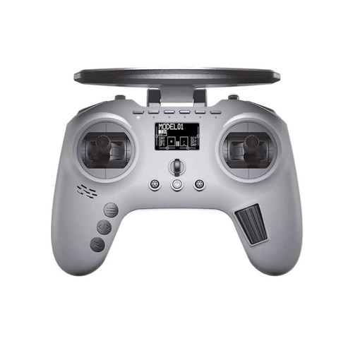<a href="jumper/jumper-t-pro/">T-Pro</a>
</td><td>Jumper</td><td>2.10</td></tr>
<tr><td>
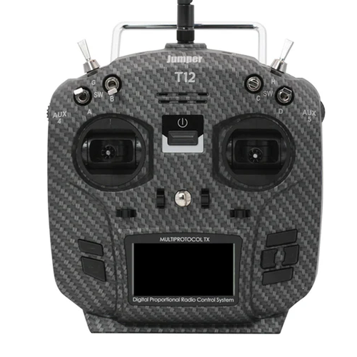<a href="jumper/jumper-t12-t12-plus-t12-pro-hall/">T-12 / T12 Plus / T12 Pro Hall</a>
</td><td>Jumper</td><td>2.10</td></tr>
<tr><td>
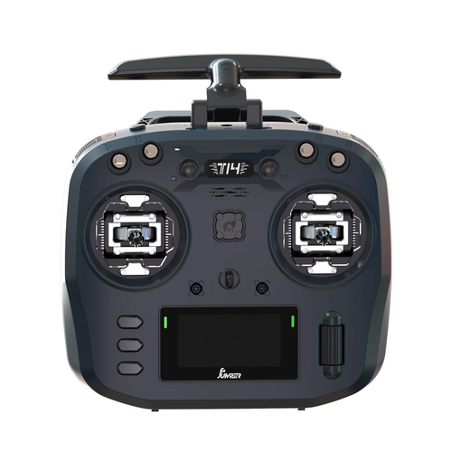<a href="jumper/jumper-t14/">T-14</a>
</td><td>Jumper</td><td>2.10</td></tr>
<tr><td>
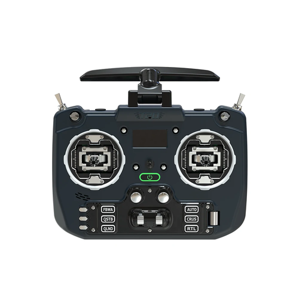<a href="jumper/jumper-t20/">T-20</a>
</td><td>Jumper</td><td>2.10</td></tr>
<tr><td>
<a href="jumper/jumper-t20-v2/">T20 V2</a>
</td><td>Jumper</td><td>2.10</td></tr>
<tr><td>
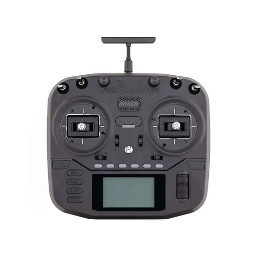<a href="radiomaster/radiomaster-boxer/">Boxer</a>
</td><td>RadioMaster</td><td>2.10</td></tr>
<tr><td>
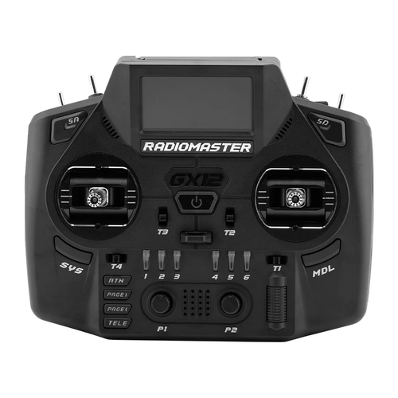<a href="radiomaster/radiomaster-gx12/">GX12</a>
</td><td>RadioMaster</td><td>2.11</td></tr>
<tr><td>
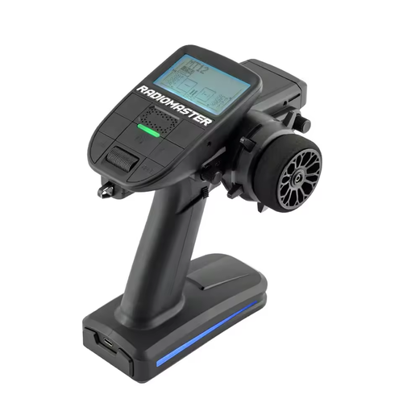<a href="radiomaster/radiomaster-mt12/">MT12</a>
</td><td>RadioMaster</td><td>2.10</td></tr>
<tr><td>
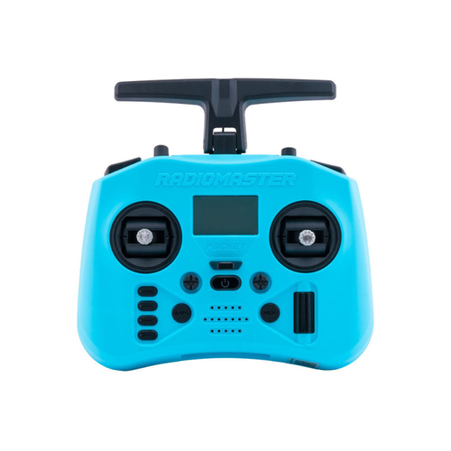<a href="radiomaster/radiomaster-pocket/">Pocket</a>
</td><td>RadioMaster</td><td>2.10</td></tr>
<tr><td>
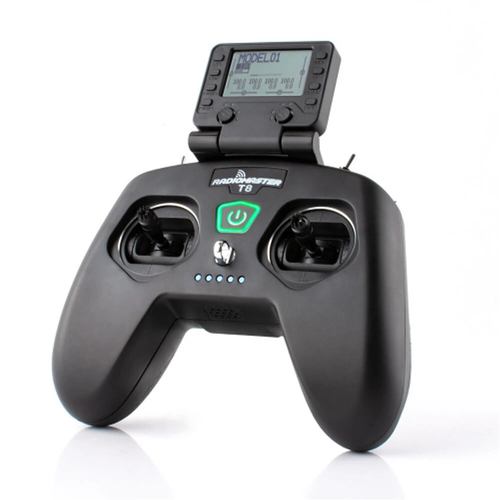<a href="radiomaster/radiomaster-t8-pro/">T8 Pro</a>
</td><td>RadioMaster</td><td>-</td></tr>
<tr><td>
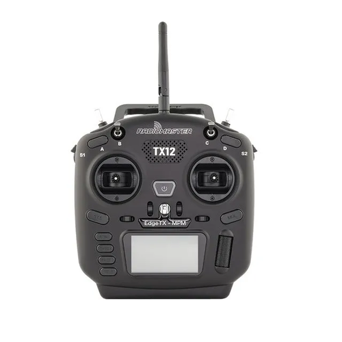<a href="radiomaster/radiomaster-tx12/">TX12</a>
</td><td>RadioMaster</td><td>2.10</td></tr>
<tr><td>
<a href="radiomaster/radiomaster-tx12-mark-ii/">TX12 Mark II</a>
</td><td>RadioMaster</td><td>2.10</td></tr>
<tr><td>
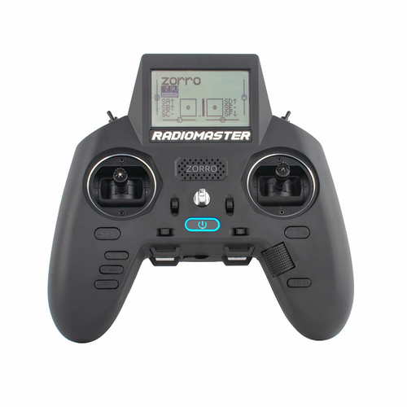<a href="radiomaster/radiomaster-zorro/">Zorro</a>
</td><td>RadioMaster</td><td>2.10</td></tr>
</tbody>
</table>

## Radios with Grayscale LCD screen

<table class="radio-list-table radio-overview-list-table">
<thead><tr><th>Model</th><th>Manufacturer</th><th>from EdgeTX</th></tr></thead>
<tbody>
<tr><td>
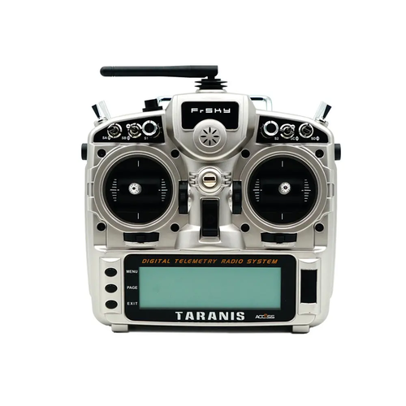<a href="frsky/frsky-x9d-x9d-plus-x9d-plus-se/">X9D / X9D+ / X9D SE</a>
</td><td>FrSky</td><td>2.10</td></tr>
<tr><td>
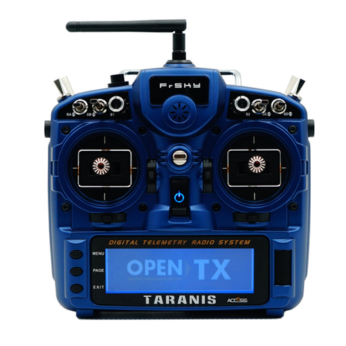<a href="frsky/frsky-x9dp2019/">X9D+ 2019 / X9D+ 2019 SE</a>
</td><td>FrSky</td><td>2.10</td></tr>
<tr><td>
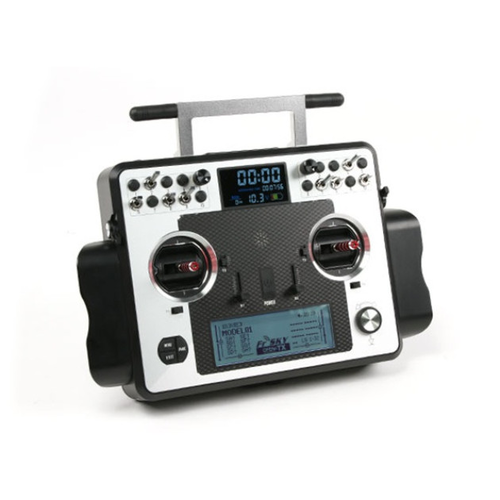<a href="frsky/frsky-x9e-x9e-hall/">X9E / X9E Hall</a>
</td><td>FrSky</td><td>2.10</td></tr>
</tbody>
</table>

## Radios with COLOR LCD screen

<table class="radio-list-table radio-overview-list-table">
<thead><tr><th>Model</th><th>Manufacturer</th><th>from EdgeTX</th></tr></thead>
<tbody>
<tr><td>
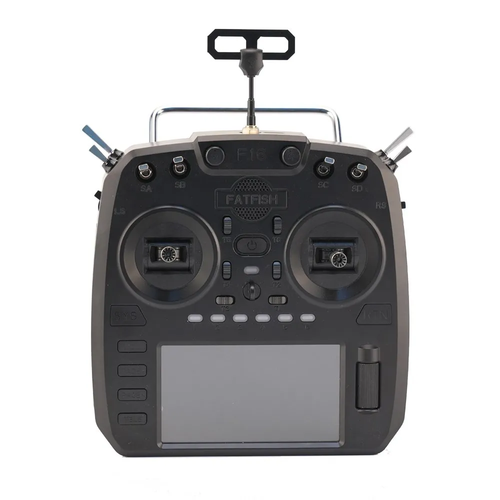<a href="fatfish/fatfish-f16/">F16</a>
</td><td>FatFish</td><td>2.10</td></tr>
<tr><td>
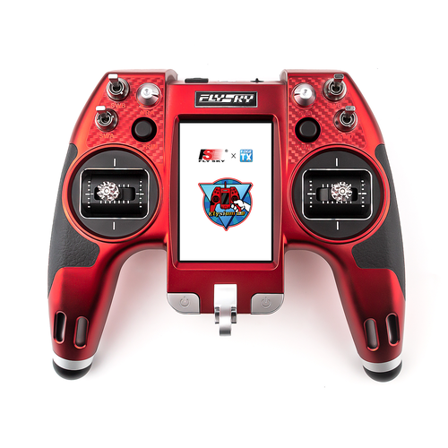<a href="flysky/flysky-el18/">EL18</a>
</td><td>FlySky</td><td>2.10</td></tr>
<tr><td>
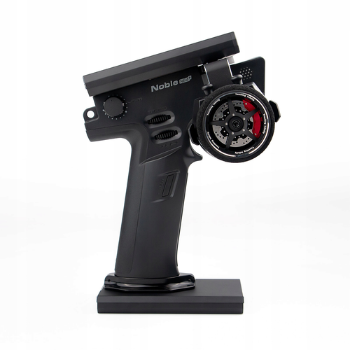<a href="flysky/flysky-nb4-plus/">NB4+</a>
</td><td>FlySky</td><td>2.11</td></tr>
<tr><td>
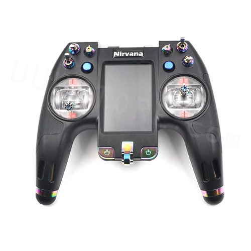<a href="flysky/flysky-nv14/">NV14</a>
</td><td>FlySky</td><td>2.10</td></tr>
<tr><td>
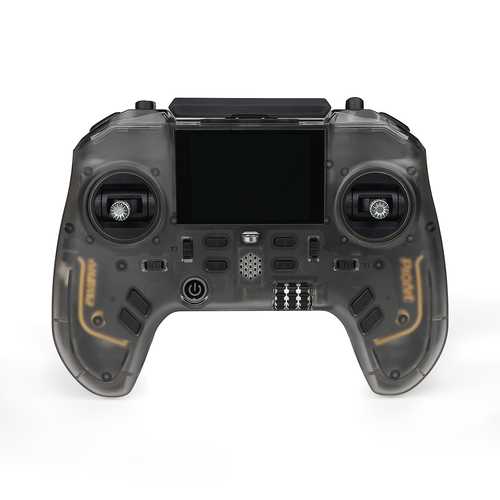<a href="flysky/flysky-pa01/">PA01</a>
</td><td>FlySky</td><td>2.11</td></tr>
<tr><td>
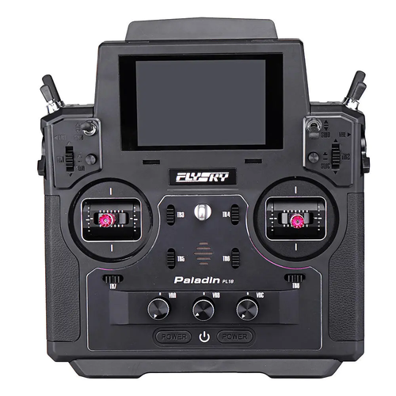<a href="flysky/flysky-pl18-pl18ev/">PL18 / PL18EV</a>
</td><td>FlySky</td><td>2.10</td></tr>
<tr><td>
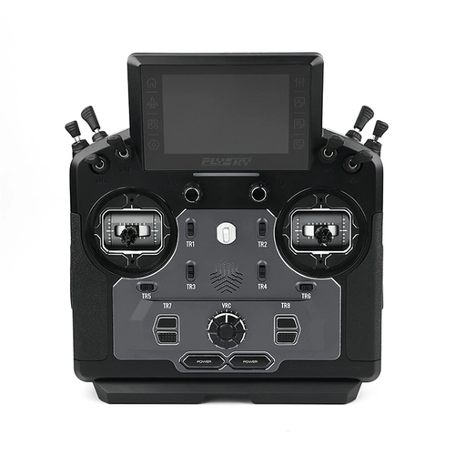<a href="flysky/flysky-pl18u/">PL18U</a>
</td><td>FlySky</td><td>2.11</td></tr>
<tr><td>
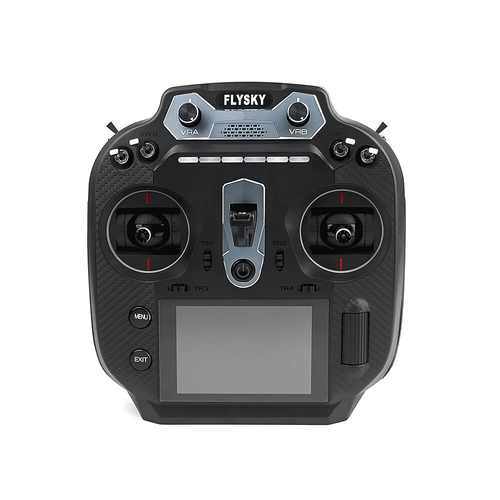<a href="flysky/flysky-st16/">ST16</a>
</td><td>FlySky</td><td>2.11</td></tr>
<tr><td>
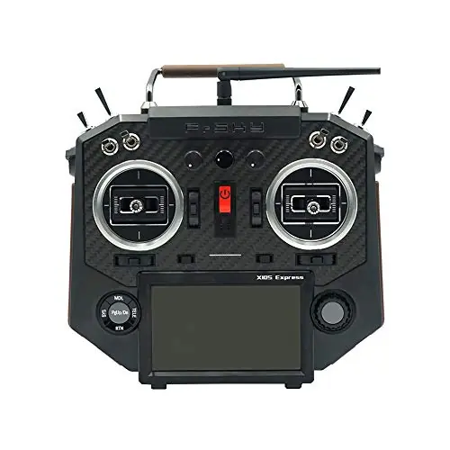<a href="frsky/frsky-x10express/">X10 / X10S / X10 Express / X10S Express</a>
</td><td>FrSky</td><td>2.10</td></tr>
<tr><td>
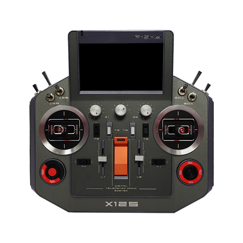<a href="frsky/frsky-x12s-x12s-irsm/">X12S / X12S IRSM</a>
</td><td>FrSky</td><td>2.10</td></tr>
<tr><td>
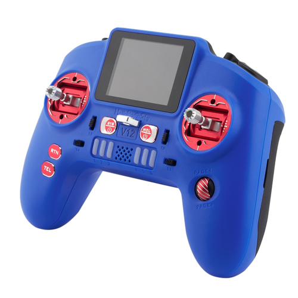<a href="helloradiosky/helloradiosky-v12/">V12</a>
</td><td>HelloRadioSky</td><td>2.11</td></tr>
<tr><td>
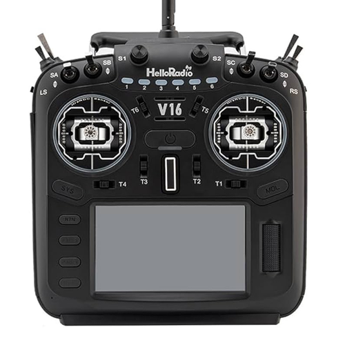<a href="helloradiosky/helloradiosky-v16/">V16</a>
</td><td>HelloRadioSky</td><td>2.11</td></tr>
<tr><td>
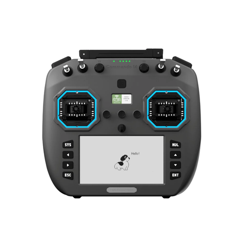<a href="iflight/iflight-commando14/">Commando14</a>
</td><td>iFlight</td><td>-</td></tr>
<tr><td>
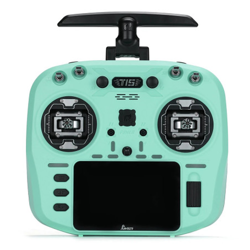<a href="jumper/jumper-t15/">T15</a>
</td><td>Jumper</td><td>2.10</td></tr>
<tr><td>
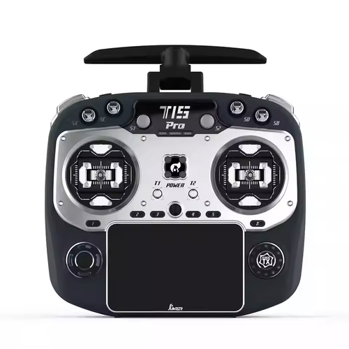<a href="jumper/jumper-t15-pro/">T15 Pro</a>
</td><td>Jumper</td><td>2.12</td></tr>
<tr><td>
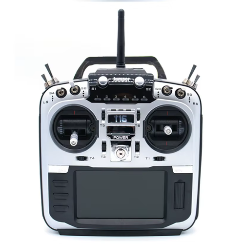<a href="jumper/jumper-t16-t16-plus-t16-pro-hall/">T16 / T16 Plus / T16 Pro Hall</a>
</td><td>Jumper</td><td>2.10</td></tr>
<tr><td>
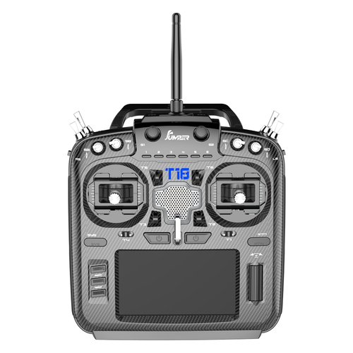<a href="jumper/jumper-t18-t18-lite-t18-pro/">T18 / T18 Lite / T18 Pro</a>
</td><td>Jumper</td><td>2.10</td></tr>
<tr><td>
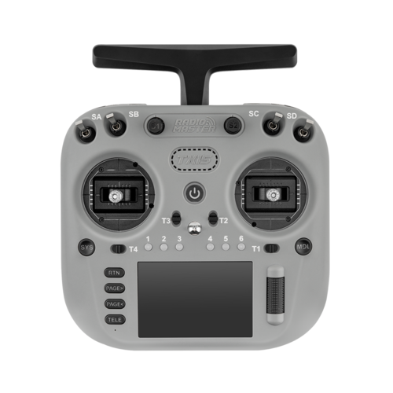<a href="radiomaster/radiomaster-tx15/">TX15</a>
</td><td>RadioMaster</td><td>2.12</td></tr>
<tr><td>
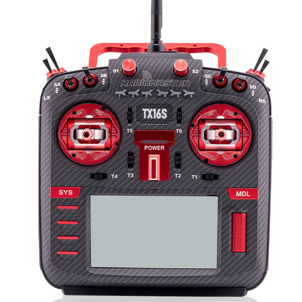<a href="radiomaster/radiomaster-tx16s/">TX16S / TX16S MAX / TX16S Mark II</a>
</td><td>RadioMaster</td><td>2.10</td></tr>
<tr><td>
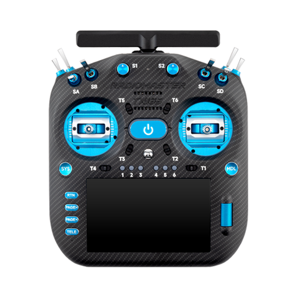<a href="radiomaster/radiomaster-tx16smk3/">TX16S MK3 / TX16S MK3 MAX</a>
</td><td>RadioMaster</td><td>2.12</td></tr>
</tbody>
</table>
